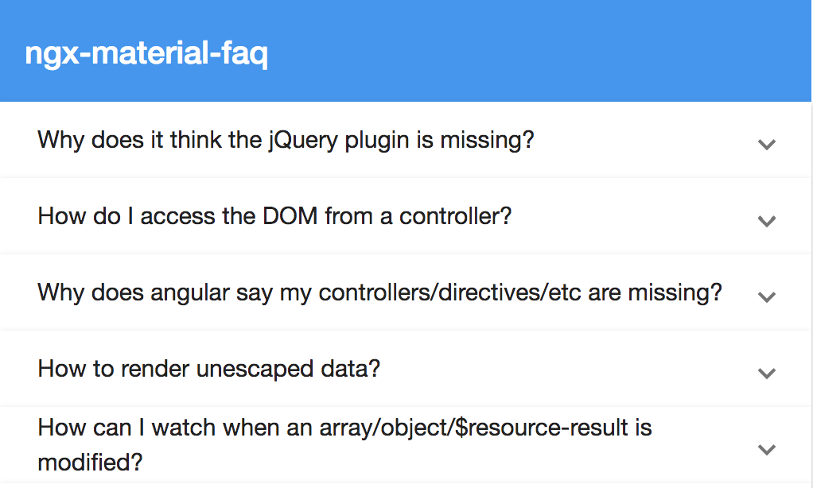
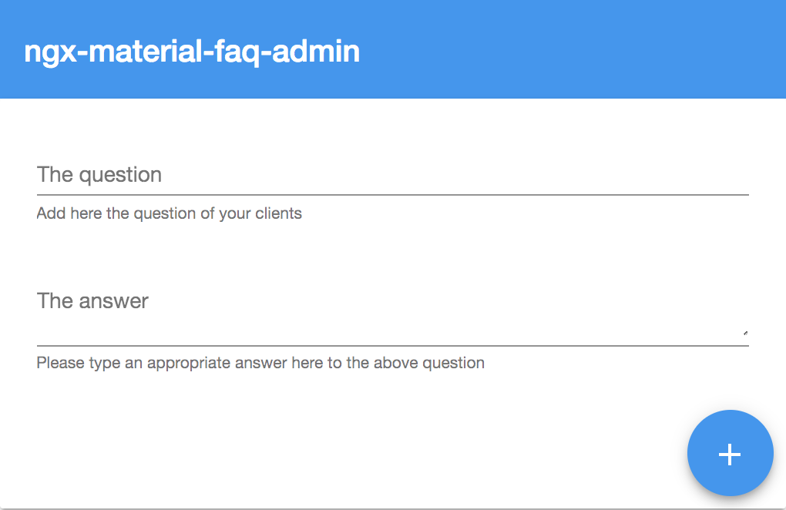

<p align="center">
  
</p>

# ngx-material-faq - Angular Library built with material design in order to provide a reusable faq (frequently asked questions) component for every project. Ask, Answer and List

[](https://badge.fury.io/js/ngx-material-faq),
[](https://anthonynahas.github.io/ngx-material-faq)
[](https://coveralls.io/github/anthonynahas/ngx-material-faq?branch=master)
[](https://coveralls.io/github/anthonynahas/ngx-material-faq?branch=master)
[](https://david-dm.org/anthonynahas/ngx-material-faq)
[](https://david-dm.org/anthonynahas/ngx-material-faq#info=devDependencies)
[](https://greenkeeper.io/)
[](https://github.com/AnthonyNahas/ngx-material-faq/blob/master/LICENSE)


<p align="center">
  
</p>


## Demo

View all the directives in action at https://anthonynahas.github.io/ngx-material-faq

## Dependencies
* [Angular v6.x](https://angular.io) (*requires* Angular 2 or higher, tested with 2.0.0) - Angular V6 - Material V6 are now supported

### Requirements (peer dependencies):
- [angular flex-layout v6.0.0-beta.15](https://www.npmjs.com/package/@angular/flex-layout)
- [angular material v6.0.2](https://www.npmjs.com/package/@angular/material)
- [angular cdk v6.0.2](https://www.npmjs.com/package/@angular/cdk)
- [angular animations v6.0.2](https://www.npmjs.com/package/@angular/animations)
- [angular forms v6.0.2](https://www.npmjs.com/package/@angular/forms)

```bash
npm i @angular/cdk @angular/material @angular/flex-layout @angular/animations @angular/forms 
```

### Additional requirements (Material Design)
- [angular material theme](https://material.angular.io/guide/getting-started#step-4-include-a-theme)
- [angular material icons](https://material.angular.io/guide/getting-started#step-6-optional-add-material-icons)


## Installation
Install above dependencies via *npm*. 

Now install `ngx-material-faq` via:
```shell
npm install -s ngx-material-faq
```

---
##### SystemJS
>**Note**:If you are using `SystemJS`, you should adjust your configuration to point to the UMD bundle.
In your systemjs config file, `map` needs to tell the System loader where to look for `ngx-material-faq`:
```js
map: {
  'ngx-material-faq': 'node_modules/ngx-material-faq/bundles/ngx-material-faq.umd.js',
}
```
---

Once installed you need to import the main module:
```js
import { NgxMaterialFaqModule } from 'ngx-material-faq';
```
The only remaining part is to list the imported module in your application module. The exact method will be slightly
different for the root (top-level) module for which you should end up with the code similar to (notice ` NgxMaterialFaqModule .forRoot()`):
```js
import { NgxMaterialFaqModule } from 'ngx-material-faq';

@NgModule({
  declarations: [AppComponent, ...],
  imports: [NgxMaterialFaqModule.forRoot(), ...],  
  bootstrap: [AppComponent]
})
export class AppModule {
}
```

Other modules in your application can simply import ` NgxMaterialFaqModule `:

```js
import { NgxMaterialFaqModule } from 'ngx-material-faq';

@NgModule({
  declarations: [OtherComponent, ...],
  imports: [NgxMaterialFaqModule, ...], 
})
export class OtherModule {
}
```

## Usage

add the `ngx-material-faq` or the `ngx-material-faq-admin` element to your template:


### ngx-material-faq

**This component aims to list the provided frequently asked questions**

<p align="center">
  
</p>

```html
<ngx-material-faq [faqList]="list"></ngx-material-faq>
```

```typescript
import {Component, OnInit, ViewEncapsulation} from '@angular/core';
import {FaqItem} from 'ngx-material-faq';

export class HomeComponent implements OnInit {
  
    ngOnInit() {
    }

  list: FaqItem[] = [
    {
          question: 'Why does it think the jQuery plugin is missing?',
          answer: 'Remember: load jQuery before AngularJS if you are using jQuery plugins!'
        },
        {
          question: 'How do I access the DOM from a controller?',
          answer: 'DO NOT perform DOM selection/traversal from the controller. The HTML hasn\'t rendered yet. Look up \'directives\'.'
        }
  ];
  
 }
 
 ```

### ngx-material-faq-admin

**This component is actually for admin purposes, like to add a frequently 
asked question to the backend, firebase ... and so on..**

<p align="center">
  
</p>

```html
<ngx-material-faq-admin [title]="'Admin'" (onFAQItemAdded)="onNewFaqItem($event)"></ngx-material-faq-admin>
```

in your component

```typescript
import {Component, OnInit, ViewEncapsulation} from '@angular/core';
import {FaqItem} from 'ngx-material-faq';

export class HomeComponent implements OnInit {
  
   ngOnInit() {
      }

  faq: FaqItem[] = [];
  
  onNewFaqItem(faqItem: FaqItem) {
      console.log('on new faqItem -> ', faqItem);
      this.faq.splice(0, 0, faqItem);
    }
  
 } 
```

### Please checkout the full documentation [here](https://anthonynahas.github.io/ngx-material-faq/doc/index.html) or follow the official [tutorial](https://anthonynahas.github.io/ngx-material-faq/getting-started)

## Development

1. clone this [repo](https://github.com/AnthonyNahas/ngx-material-faq)
2. Install the dependencies by running `npm i`
3. build the library `npm run build` or `gulp build`
To generate all `*.js`, `*.d.ts` and `*.metadata.json` files:

```bash
$ npm run build
```

4. Link the library 
  - on windows `gulp link` or locally `npx gulp link`
  - on mac/linux `sudo gulp link` or locally `sudo npx gulp link`
  
 5. Navigate to the demo app's directory
  - `cd demo`
  _ `npm i`
  _ `npm start`

extras
To lint all `*.ts` files:

```bash
$ npm run lint
```


## Other Angular Libraries
- [ngx-auth-firebaseui](https://github.com/AnthonyNahas/ngx-auth-firebaseui)
- [ngx-material-pages](https://github.com/AnthonyNahas/ngx-material-pages)
- [ngx-material-password-strength](https://github.com/AnthonyNahas/ngx-material-password-strength)
- [ngx-material-contacts](https://github.com/AnthonyNahas/ngx-material-contacts)
- [ngx-combination-generator](https://github.com/AnthonyNahas/combination-generator)


## License

Copyright (c) 2018 anthonynahas. Licensed under the MIT License (MIT)

